# Bug Triage Env

**Meta/PyTorch OpenEnv Hackathon - Round 1 | Team Dhurandhar**

An OpenEnv-compliant RL environment for training and evaluating AI agents on real-world GitHub bug report triage. Agents learn to classify bugs across 3 tasks of increasing difficulty using 530 real bug reports from 15 popular open-source repositories.

**Live Demo:** [HuggingFace Space](https://huggingface.co/spaces/Inder7277/bug-triage-env)

---

## Quick Start

### Requirements

- Python 3.11+
- HuggingFace API Token (for LLM inference)

### Setup

```bash
git clone https://github.com/Inderpal004/dhurandhar.git
cd dhurandhar
pip install -r requirements.txt
```

`requirements.txt` contains the slim core packages needed to run the environment, the demo, and the inference baseline. The optional GRPO/LoRA training pipeline in `train_rl.py` requires heavier ML dependencies, which are provided separately in `requirements-training.txt`.

### Demonstration

Run the automated demo script to view environment mechanics, tasks, and reward shaping in action without requiring API keys. The final scores printed by the demo represent the average reward (0.0 to 1.0) achieved by a simple baseline heuristic agent compared to human ground truth data:

```bash
python demo.py
```

### LLM Inference

Create a `.env` file with your credentials:

```env
HF_TOKEN=your_token_here
API_BASE_URL=https://router.huggingface.co/v1
MODEL_NAME=Qwen/Qwen2.5-72B-Instruct
```

Execute baseline evaluation:

```bash
python inference.py
```

This outputs results in the mandatory `[START]/[STEP]/[END]` format. Options include `--repos "pytorch/pytorch"` for repository filtering and `--episodes N` for custom run lengths.

---

## Environment Architecture

<p align="center">
  
</p>
<p align="center">
  
</p>

### The Problem
Open-source maintainers receive hundreds of issues weekly. Bug Triage Env automates the triage process by training agents to determine issue criticality, severity, root cause, and appropriate assignee.

### Why This Matters for RL Training

Most OpenEnv environments are games or synthetic benchmarks. Frontier agent post-training needs environments that mirror the workflows engineers actually do — Bug Triage Env directly measures an agent's ability to replace a repetitive, high-volume human task.

**What this environment trains**: multi-field classification under ambiguous signal, calibration awareness, and team-routing intuition. These are the exact skills required for an agent to autonomously handle incoming issues on a real repository.

**How RL learns from this**: every bug is an independent episode with a dense shaped reward (base score + calibration bonus + reasoning bonus + edge-case bonus). That density lets GRPO, PPO, or DPO make meaningful gradient updates without long rollouts — critical given the hackathon's 20-minute runtime budget.

### Tasks & Grading

1. **Criticality Detection (Easy)**: Binary classification (`critical` or `non_critical`). Graded strictly: 1.0 (correct) or 0.0 (incorrect).
2. **Severity Scoring (Medium)**: 5-point scale (1-trivial to 5-outage). Partial credit awarded: 1.0 (exact), 0.7 (off-by-1), 0.4 (off-by-2).
3. **Root Cause & Assignee (Hard)**: Dual-prediction task. Score = `(0.6 * root_cause_score) + (0.4 * assignee_score)`. Partial credit is given for selecting related root causes or assignees from the correct team.

### Grader Design Rationale
- **Severity 1.0 / 0.7 / 0.4 / 0.0** — Real-world triage disagreements are almost always within ±1 level. Off-by-1 keeps 70% credit because the agent is still making a useful call; off-by-2 drops to 40% because it materially changes the response SLA.
- **Root-cause 0.6 / assignee 0.4 weighting** — Root cause is semantically more important than exact assignee because routing to the right *team* is what matters. Partial credit for "same team" assignees encodes this.
- **Confidence calibration bonus (+0.08 / +0.02 / −0.05)** — Confidence is only valuable if calibrated. A ±0.15 window rewards calibration; a >0.3 miss actively penalizes overconfident wrong answers.
- **Edge-case bonus (+0.10) on ambiguous bugs** — Bugs where two root-cause categories tie are the hardest. Extra reward pushes agents toward robust reasoning instead of pattern-matching.

### Reward Function
Total Reward = Base Score + Confidence Bonus + Reasoning Bonus + Edge Case Bonus (clamped between 0.0 and 1.0).
Agents are specifically rewarded for highly calibrated confidence estimations and detailed reasoning.

---

## Dataset

- **Scale**: 530 real bug reports fetched via GitHub API.
- **Coverage**: 15 repositories including PyTorch, Flask, FastAPI, NumPy, and Transformers.
- **Contributors**: 225 recorded developers with mapped expertise domains.

---

## API Usage

```python
from src.env import BugTriageEnv
from src.models import BugTriageAction

# Initialize and start episode
env = BugTriageEnv()
obs = env.reset(task_id="task_criticality")

# Execute action
action = BugTriageAction(
    task_id="task_criticality",
    bug_id=obs.bug_report.bug_id,
    criticality="critical",
    confidence=0.9,
    reasoning="System crash reported"
)
result = env.step(action)
print(f"Reward: {result.reward}")
```

---

## Project Structure

- `inference.py` — Baseline inference compliant with OpenEnv specifications. Emits `[START] / [STEP] / [END]` logs.
- `demo.py` — Heuristic baseline demo, no API key required.
- `train_rl.py` — RL training pipeline using GRPO and LoRA. Install the specific ML dependencies for this script using `pip install -r requirements-training.txt`.
- `server/app.py` — FastAPI + Gradio UI server for HuggingFace Spaces (mounts `/reset`, `/step`, `/health`, `/schema`).
- `src/` — Core environment implementation: `env.py`, `models.py`, `tasks.py`, `graders.py`, `reward.py`, `github_fetcher.py`.
- `tests/` — Unit and integration tests for env, graders, tasks, and inference.
- `openenv.yaml` — OpenEnv environment manifest.
- `Dockerfile` — Reproducible container build for HF Spaces.

---

## Technologies Used

- [OpenEnv](https://github.com/pytorch/openenv)
- [Pydantic](https://docs.pydantic.dev/)
- [TRL](https://github.com/huggingface/trl) & [PEFT](https://github.com/huggingface/peft)
- [OpenAI Python SDK](https://github.com/openai/openai-python)
